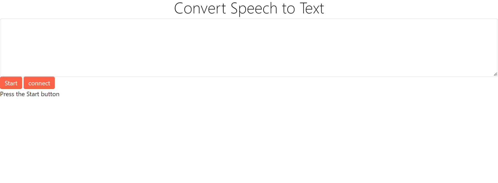

## IOT task🗣:<br />
**○ Web Page Programming for Arm Control Using web serial API** <br />
**○ Writing Arduino Code for Control**<br />

## Web Page view🌐:<br />

**Here when you click on a connect it will show a small window to choose the right port that connect to arduino board, then you can click on a start and say the direction you want** <br />

 <br />
[Web page link!](https://alhanoofalsagir.github.io/Robot-arm-controller/)

## command ▶ :

if you have servo you can test the script connect the servo to pin 8 and write this command in seral monitor 


```
left
right
top
```
